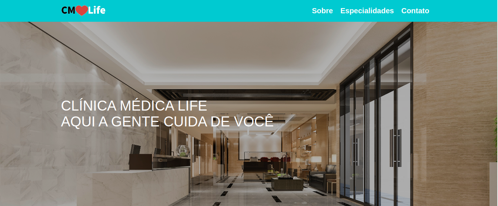

# Projeto CLinica

## Sobre
____________________________________________________________________
A proposta desse projeto é criar uma página web responsiva utilizando as tecnologias HTML e CSS.

Dessa forma  pode colocar em prática os seguintes conceitos:

Utilizar tags HTML básicas e semânticas;
Utilizar tags de tabelas;
Utilizar Flexbox e media queries.

## Execução
____________________________________________________________________
O site é responsivo, isso significa que ele se adapta com o tamanho da tela do usuário.

## Site em dispositivos tela cheia

## Site em dispositivos móveis

